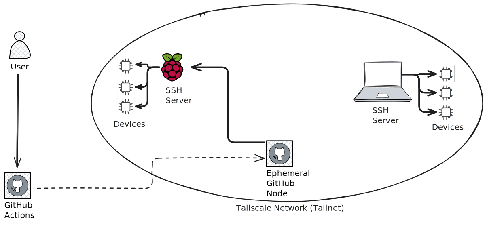
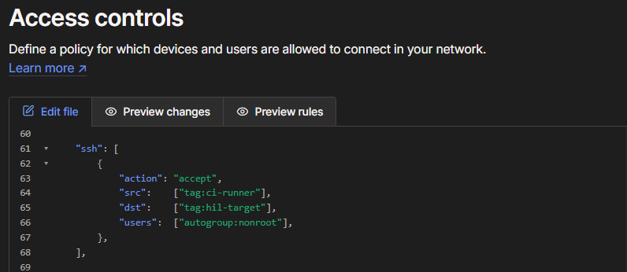

# pyocd-ci-prototype

Workflow and script to test on lenders' hardware using pyOCD and Tailscale.

## 🌐 Architecture



## 🔁 Lending Hardware

Whenever a lender wants to add a new SSH server to the network, the admin must generate an authkey.  
After sharing the key with the lender, the lender must [install Tailscale on the server](https://tailscale.com/kb/1347/installation).  
After installing, they need to add their device using the authkey:

```bash
   tailscale up --authkey=<auth_key_from_admin>
```

To learn more about adding devices, read [this](https://tailscale.com/kb/1316/device-add).

## 🔁 Borrowing Hardware

For proper security, borrowers must use an **OAuth Client** given by the network admin.

Usage examples can be found in [.github/workflows/tailscale-prototype.yml](.github/workflows/tailscale-prototype.yml) and in Tailscale's [OAuth Client article](https://tailscale.com/kb/1215/oauth-clients).

## 🔑 Authentication & Secure Access

To prevent unwanted access to lender hardware, the admin has to modify the SSH setting in the access control list (ACL).  
Here's an example of the SSH rule I used in my test:



Tailscale has more examples [here](https://tailscale.com/kb/1192/acl-samples).

## 🏷️ Resource Tagging

To solve the issue of hardware resources, lenders can add **tags** to their devices.  
These tags can be read through the cli by running:
```bash
   tailscale status --json
```

It's possible to search for these tags and pair a job with a suitable runner, but this is not built-in.  
NOTE: Tags can be added to **all** devices, even the ephemeral node created by Github Actions.

## 🧪 Running Tests

To run Github Actions + Tailscale, the borrower needs to use Tailscale's Github Action, along with their *secret* OAuth Client information and tags.  
For more information, look at [Tailscale's article](https://tailscale.com/kb/1276/tailscale-github-action) and [.github/workflows/tailscale-prototype.yml](.github/workflows/tailscale-prototype.yml), where the action is called.


## 📦 Future Work

### 🔐 Security Considerations

- MFA can be used with Tailscale SSH (See [TailScale check mode](https://tailscale.com/kb/1193/tailscale-ssh#check-mode))
- We can test how SSH users are verified (See [Tailscale SSH tests](https://tailscale.com/kb/1337/policy-syntax#sshtests))
- How do we verify that code is safe to run on hardware?
- How do we prevent DoS attacks?
- We can restrict borrowers to testing files using user privileges 

### 🚦 Error Handling & Propagation

In my testing, running the SSH running the testing scripts will pass on successful SSH login, independent from the code ran in the SSH.  
This means that a failing test will pass on Github Actions.